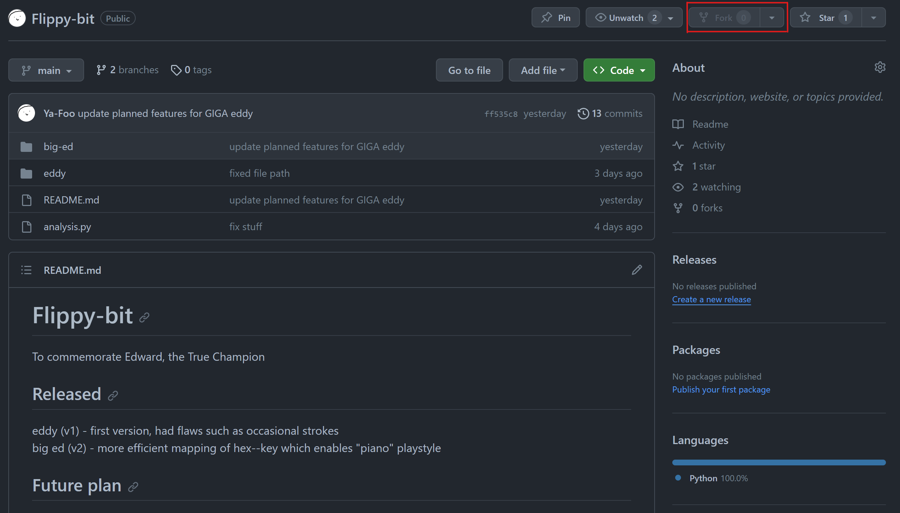
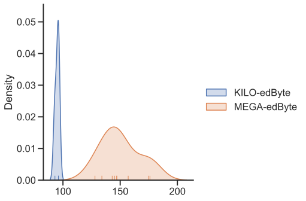
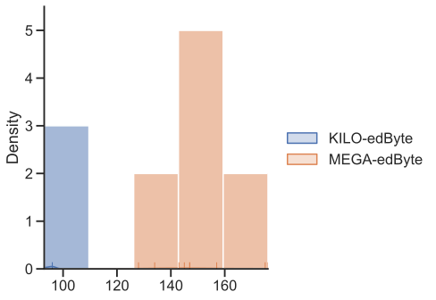

# edByte

To commemorate Edward, the True Flippy Bit Champion

## Versions

### Released

KILO-edByte (v1) - first version, had flaws such as occasional strokes which causes delay  
MEGA-edByte (v2) - more efficient mapping of hex--key which enables "piano" playstyle

### Future plan

UPCOMING: GIGA-edByte (v3)  
Features planned:

1. In death wave switch to targetting individual hex instead?
2. Prevents any user input (so no sabotage)
3. On slower computers the program would stop after a while, so find out when this occurs by
playing a trial round then after 2nd play, switch to bullet spray mode after that threshold
4. Noted that on slow computers, at the death wave it would be so slow that keyboard smashing will get you to above 160. So...how about we write a program that will intentionally slow our computer down and achieve this result?

## Analysis and comparison

### Data contribution

You can contribute to this repository by running the bot on your computer and the score you get will be recorded into the bot's respective `log.txt` file. As more data are added, we can better evaluate the bot's performance.  
Or if you want something code-related, then I would appreciate it if someone code a test function to test the bot multiple times in the background.

#### Requirements

* Git Bash installed
* Python set up in the computer
* (optional) GitHub Desktop installed
* (optional) IDE or a code editor installed

#### Instructions

1. Fork this repository by going to the top-right corner of the page then click __Fork__.


2. Navigate to your forked repository.
Click __<> Code__.

3. Cloning:
   * If you have GitHub Desktop, then simply click __Open with GitHub Desktop__ then follow the instructions of the app.
   * Otherwise, copy the HTTPS then open Git Bash and type `git clone`. Paste the HTTPS you just copied in and it should look like this:

        ```bash
        git clone https://github.com/YOUR-USERNAME/Flippy-bit
        ```

     Press __Enter__ and the local clone will be created.
4. Create a branch

    ```bash
    git checkout -b branch-name
    ```

5. Open Powershell in the same directory then type in the command below to install the necessary libraries

    ```powershell
    python -m pip install -r requirements.txt
    ```

6. Execute the `bot.py` on the version you want to play as many times as you like.
7. (optional) Run `analysis.py`
8. Commit and push.

    ```bash
    git add .
    git commit -m 'Commit message'
    git push origin branch-name
    ```

9. Create a new pull request from your forked repository (Click __New Pull Request__ at the top of your repository)

### Graphs

Kernel Distribution Estimation Plot  


Histogram  


Box and Whisker Plot  

